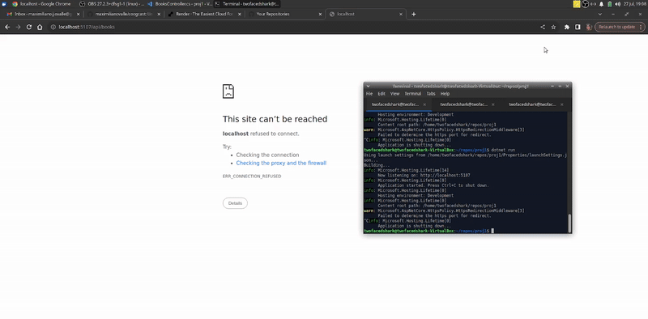
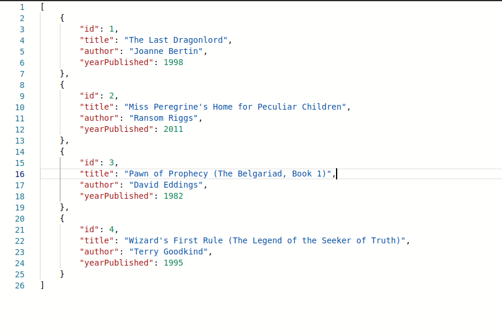

# Books API

<!-- ABOUT THE PROJECT -->
## About The Project



Simple books REST API using the ASP.NET Core Web API template!

## Getting Started

### Prerequisites

* C# Dev Kit VS Code Extension
* .NET

### Installation

1. Clone the repository
```sh
git clone git@github.com:maximilianovalle/rest-api.git
```
2. Navigate to the project directory
3. In your terminal, run the application
```sh
dotnet run
```
You should see output similar to the following:
```sh
Using launch settings from .../Properties/launchSettings.json...
Building...
info: Microsoft.Hosting.Lifetime[14]
      Now listening on: http://localhost:5107
info: Microsoft.Hosting.Lifetime[0]
      Application started. Press Ctrl+C to shut down.
info: Microsoft.Hosting.Lifetime[0]
      Hosting environment: Development
info: Microsoft.Hosting.Lifetime[0]
      Content root path: ...

```
4. Navigate to **http://localhost:5107/api/books**, you should see the following:  


5. From here, feel free to play around w/ curl in your terminal. Some examples...
* Delete book where ID = 4
```sh
curl -X DELETE http://localhost:5107/api/books/4
```
* Update book where ID = 4
```sh
curl -X PUT http://localhost:5107/api/books/4 -H "Content-Type: application/json" -d '{ "Title": "Edited", "Author": "N/A", "YearPublished": 0 }'
```
* Create a new book
```sh
curl -X POST -H "Content-Type: application/json" -d '{ "ID": 5, "Title": "Queen of Sorcery (The Belgariad, Book 2)", "Author": "David Eddings", "YearPublished": 1982 }'
```

## Acknowledgments

* [Getting Started with C# & .NET in VS Code (Official Beginner Guide)](https://www.youtube.com/watch?v=ZVGutgqBMUM)
* [Build REST APIs in .NET 9 – Full Course for Beginners](https://www.youtube.com/watch?v=38GNKtclDdE)